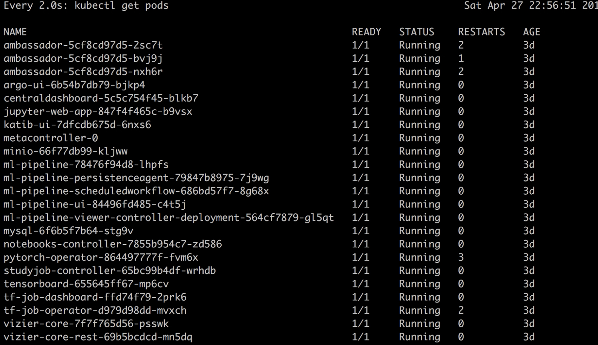
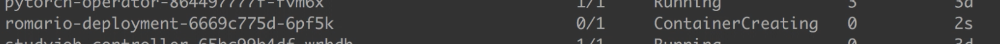
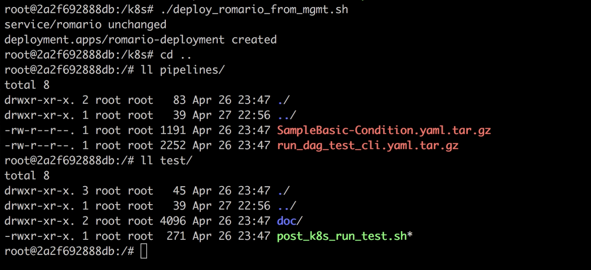
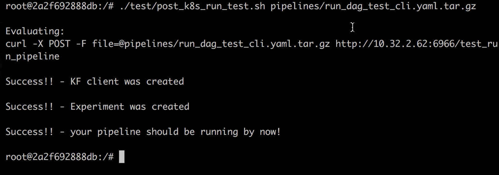

# Walkthrough DockerCon19 Demo:

On the management node of your Kubernetes cluster you can get all functionalities of romario simply by running the bhgedigital/romario image.

As romario is a Depend-on-Docker project, RUNs and EXECs are all automated. From the root of the romario repo, just execute:

`./run.sh bash`


Commands can be executed externally to the container, such as watching for the pods in the cluster. From the root of the romario repo at the management node, just execute:

`./exec.sh watch kubectl get pods`



Romario is a typical Depend-on-docker project, where all code is contained in `/` , and we have all required automation to deploy and manage the service. From the container `bash`, we can list the scripts used for the automation:

`cd k8s/ && ls -al`


To deploy _romario_ simply execute:

`./deploy_romario_from_mgmt.sh`


And you'll get a new service up on the cluster:



The service itself is very lightweight, so it should not take long to stand up. Once up, we can use the testings scripts to try out some pipelines.

```
cd /
ll pipelines/  
ll test/
```



A Swagger UI is also available through _https://<romario_end_point>/apidocs_

The POST command is automated in the test script `post_k8s_run_test.sh`. With it we can run larger workloads, as large as your compiled pipeline, as long as you define and tar it:

`./test/post_k8s_run_test.sh pipelines/run_dag_test_cli.yaml.tar.gz`




Once done we can clean the used pods:

`./k8s/destroy_pods.sh hypertune`

or even kill the service as a whole:

`./k8s/kill_romario.sh`

> __Romario is a small, lightweight service, running at the right place at the right time. If you pass it the ball, it will run it!__

```bash
|                                                 |
|       ___                      _                |
|      / _ \___  __ _  ___ _____(_)__             |
|     / , _/ _ \/  ' \/ _ `/ __/ / _ \            |
|    /_/|_|\___/_/_/_/\_,_/_/ /_/\___/  v0.1.1    |
|                                                 |
|          ___________________________            |
|         |             |             |           |
|         |___          |          ___|           |
|         |_  |         |         |  _|           |
|        .| | |.       ,|.       .| | |.          |
|        || | | )     ( | )     ( | | ||          |
|        '|_| |'       `|'       `| |_|'          |
|         |___|         |         |___|           |
|         |             |             |           |
|         |_____________|_____________|           |
```
