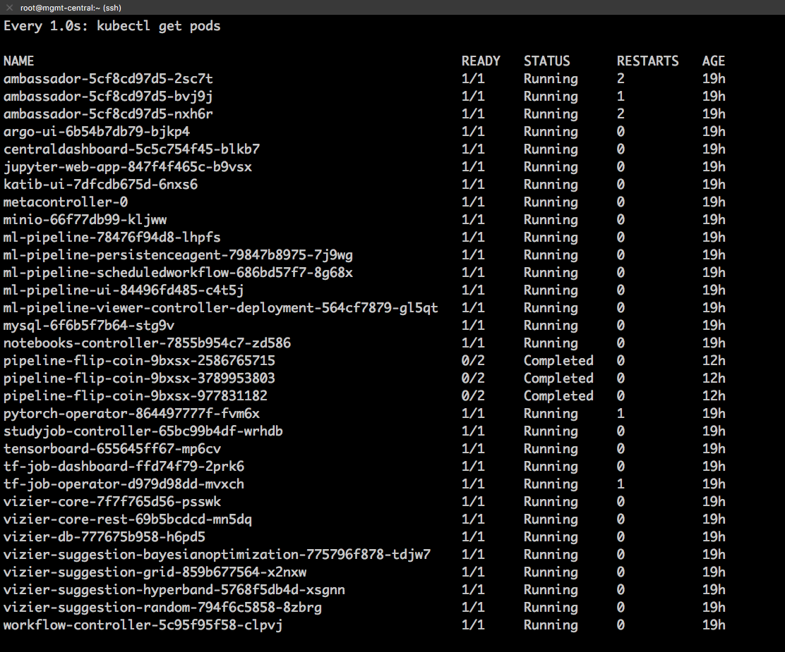
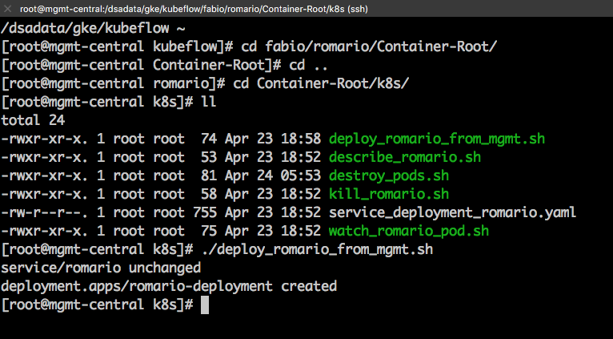
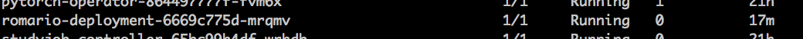
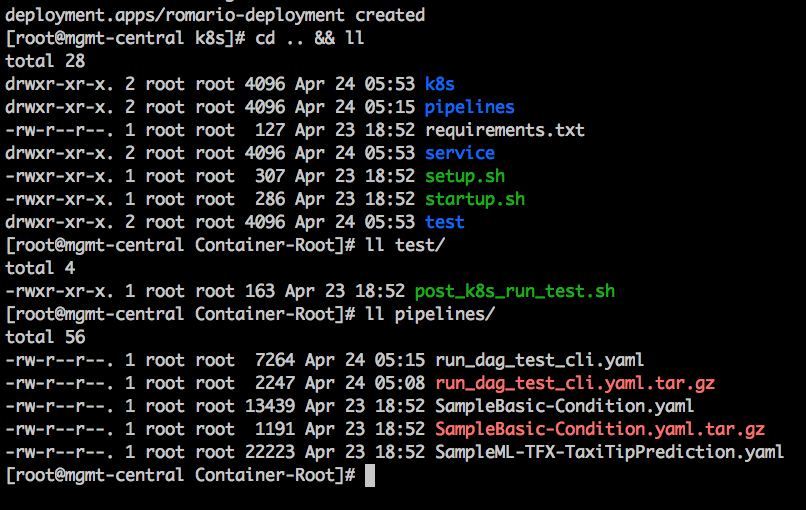
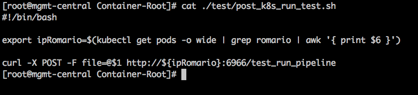
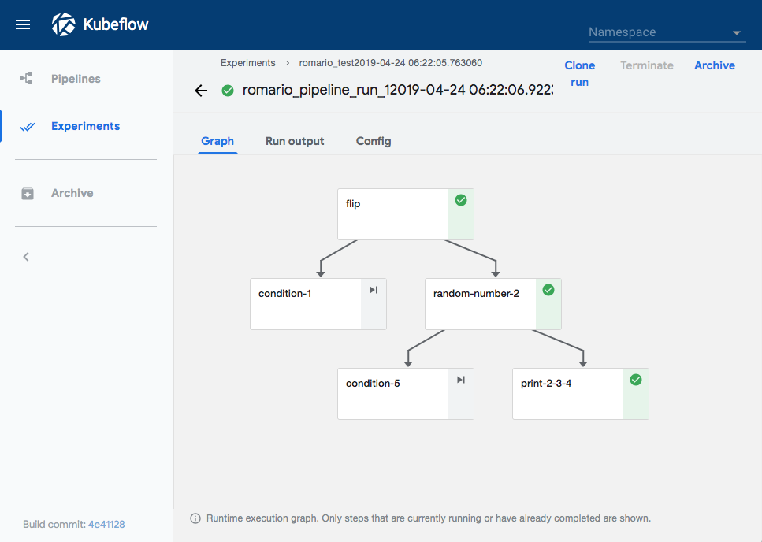
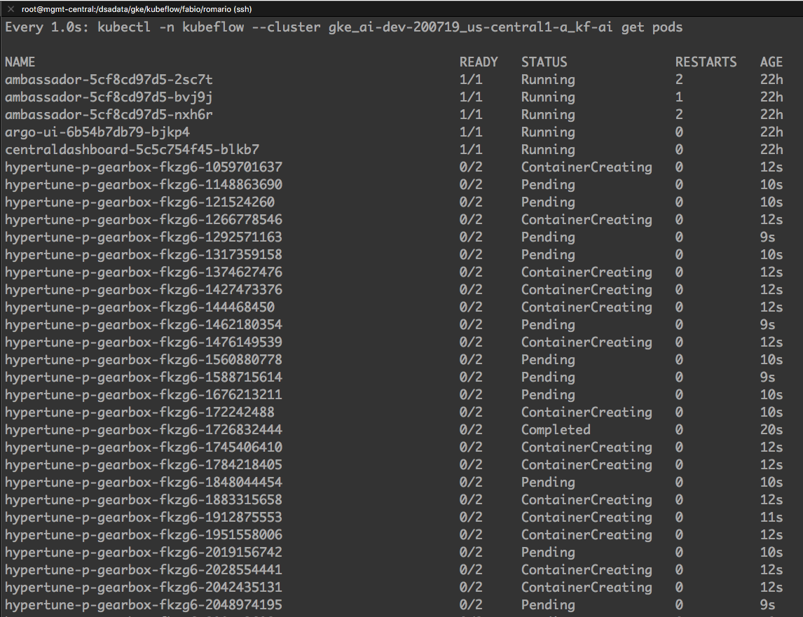
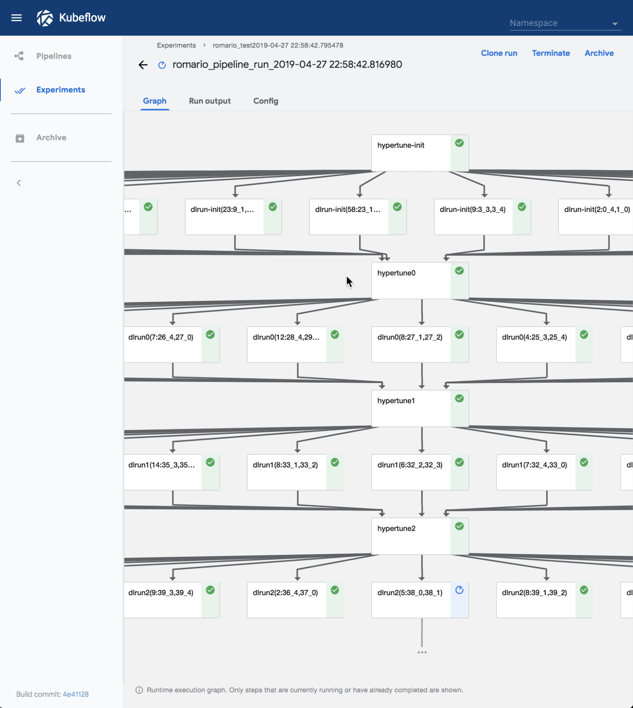
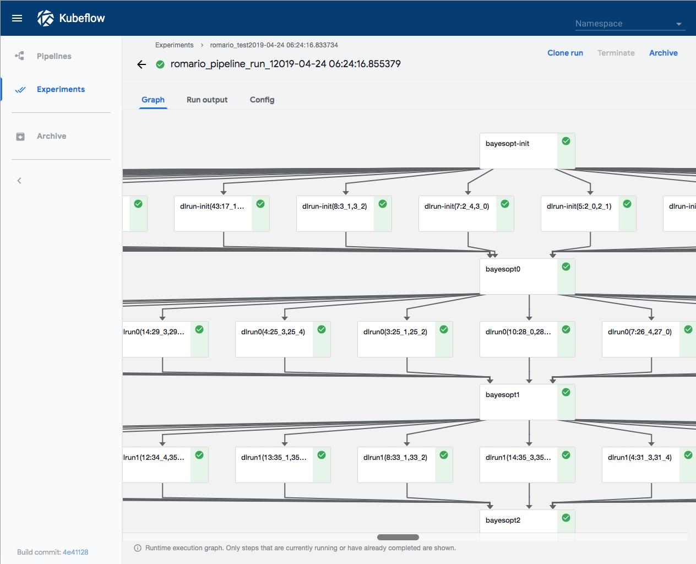

# Demo Docker Con Steps:

- 1st bash:

`watch -n 1 kubectl get pods`



- 2nd bash / From Romario root folder:

`ll`

Romario is a typical Depend-on-docker project, where all code is contained in Container-Root, and we have all required automation to build and manage the project

`cd Container-Root/k8s/`

For the deployment, we've automated some of the most usual kubectl commands, and the deployment itself, so it become seamless if you have access to the management node in your cluster.

`./deploy_romario_from_mgmt.sh`



And you'll get a new service up on the cluster:



The service itself is very lightweight, so it should not take too long to stand up. Once up we can use the testings scripts to try out some pipelines.

`cd .. && ll`

`ll pipelines/`  

`ll test/`



The POST command is automated in the test script:

`cat ./test/post_k8s_run_test.sh`



Which can be used to run a basic sample pipeline that comes with KF installation:

`./test/post_k8s_run_test.sh ./pipelines/SampleBasic-Condition.yaml.tar.gz`



We can also run larger workloads, as large as your defined pipeline, as long as you define and tar it:

`./test/post_k8s_run_test.sh ./pipelines/run_dag_test_cli.yaml.tar.gz`




Romario is a small, lightweight service, running at the right place at the right time. If you pass it the ball, it will run it!

Once done we can clean the used pods:

`./k8s/destroy_pods.sh hypertune`

or even kill the service as a whole:

`./k8s/kill_romario.sh`


```bash
  ___________________________
 |             |             |
 |___          |          ___|
 |_  |         |         |  _|
.| | |.       ,|.       .| | |.
|| | | )     ( | )     ( | | ||
'|_| |'       `|'       `| |_|'
 |___|         |         |___|
 |             |             |
 |_____________|_____________|
```
