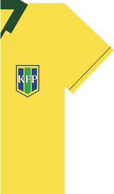

# Romario

_"You give it the ball... it will score!" - Romario, a RESTful API for kick-starting [Kubeflow Pipelines](https://github.com/kubeflow/pipelines) in your Kubernetes cluster._

The intent of _romario_ is to enable large scale runs of _KF Pipelines_, across multiple Kubernetes clusters. _KF Pipelines_ are a key way to "pythonically" orchestrate analytics pipelines, due to its straightforward abstraction of [ARGO](https://github.com/argoproj) into a Python based DSL.

For the background on the scale required for Industrial applications of ML and AI please check [this](https://www.youtube.com/watch?v=rJNSdUjjkic) and [this](https://www.youtube.com/watch?v=dIZt-Ahzew0) talk from Google Cloud NEXT 2019.

## Documentation

[Romario](https://github.com/bhgedigital/romario) provides a REST API, for executing the most usual operations performed by [KF Pipelines](https://github.com/kubeflow/pipelines).

A walkthrough of Romario is provided here: [Doc](https://github.com/bhgedigital/romario/blob/master/Container-Root/test/doc/romario_demo_walkthrough.md)

### Building the _Romario_ Project

As any [Depend-on-Docker](https://github.com/bhgedigital/depend-on-docker) project, building _Romario_ is quite easy. Once the `.env` environment file is set, it is enough to execute `build.sh`. Please refer to the [Depend-on-Docker Documentation](https://github.com/bhgedigital/depend-on-docker/blob/master/README.md) for more information on how to customize _Romario_.

### Deployment to a Kubernetes cluster

The deployment of [romario](https://github.com/bhgedigital/romario) assumes the existence of a Kubernetes cluster, with Kubeflow already deployed. The user must have access to the management node of such cluster, so that the deployment happens in the correct namespace (usualy 'kubeflow'). Please refer to [this documentation]() on how to provision such infrastructure.

Once in the management node, _romario_ gets deployed by simply running the `deploy_romario_from_master.sh` script provided [here](https://github.com/bhgedigital/romario/blob/master/Container-Root/k8s/deploy_romario_from_master.sh).

All configurations required for the _romario_ Kubernetes Service and Deployment are given [here](https://github.com/bhgedigital/romario/blob/master/Container-Root/k8s/service_deployment_romario.yaml). Other nifty automation of usual `kubectl` commands are provided in the same [k8s](https://github.com/bhgedigital/romario/tree/master/Container-Root/k8s) folder.


### Running a Pipelines

Executing a simple pipeline is easy from the Master node of the underlying Kubernetes cluster. A sample `curl -x POST ...` example is available in [romario/Container-Root/test](https://github.com/bhgedigital/romario/blob/master/Container-Root/test/post_k8s_run_test.sh). The script takes a single argument of the `.tar.gz` tarball. From the _romario_ root:

``` bash
./Container-Root/test/post_k8s_run_test.sh Container-Root/pipelines/SampleBasic-Condition.yaml.tar.gz
```

A [Swagger-UI](https://swagger.io/tools/swagger-ui/) is available at https://\<romario-endpoint\>/apidocs .   

### Running _romario_ image as a Jupyter Notebook server

Running a Jupyter Notebook server from the Master node on the cluster is simple with _romario_ and _Depend-on-Docker_. Simply execute:

```bash
./run_jupyter.sh
```

This script will map the whole _romario_ root to `/wd`, allowing for the user to compile Pipelines manually from the master. A `POST` request method to compile pipelines described in `.py` scripts is under construction, stay tuned!  

### Known Features, a.k.a Bugs

1. Pipelines should be POST as `tar.gz` files, currently POSTing `yaml` will result in an exception.

## DockerCon 2019 - Depend on Docker for AI @ the Community Theather

<div class="video-player"><div class="vidyard-player-container" uuid="LceAwJ7hDuXMLjE2frPe5U" style="margin: auto; width: 100%; height: auto; overflow: hidden; display: block;"><div class="vidyard-div-LceAwJ7hDuXMLjE2frPe5U" role="application" aria-label="media player" style="position: relative; padding-bottom: 56.25%; height: 0px; overflow: hidden; max-width: 100%;"><iframe allow="autoplay *; fullscreen *; picture-in-picture *" allowfullscreen="" allowtransparency="true" aria-label="Video" class="vidyard-iframe-LceAwJ7hDuXMLjE2frPe5U bf_frame_init" frameborder="0" height="100%" width="100%" scrolling="no" src="https://play.vidyard.com/LceAwJ7hDuXMLjE2frPe5U?v=4.2.11&amp;type=inline&amp;disable_popouts=1" title="Video" style="opacity: 1; background-color: transparent; position: absolute; top: 0px; left: 0px;" bf_offer_id="1385279605"></iframe></div></div><h3>Depend Upon Docker for AI</h3><div class="description">
                            This is the next chapter of the “Depend on Docker” series of talks that started right here at DockerCon 2018 when Alex Iankoulski (Docker Captain) and Arun Subramaniyan (VP Data Science and Analytics), BHGE presented “Depend on Docker - Imagine a world where the only dependency you need is Docker”. True to that title, followed a few talks that focused on running workloads on AWS, GCP, and Azure with Docker being the only external dependency. This talk will focus on using Docker containers in the world of Data Science, Machine Learning, and Artificial Intelligence. If you are curious about techniques to increase your processing power with GPUs and are eager to see some cool Industrial AI demos, all running in Docker, join us for this talk at DockerCon 2019!

Speakers:
Fabio Nonato de Paula - Director, Data &amp; Analytics, Baker Hughes, a GE company
Alex Iankoulski - Principal Architect - Data Science and Analytics, Baker Hughes, a GE company                        </div></div>


## Disclosures & Acknowledgments

[Romario](www.github.com/bhgedigital) wraps the Python DSL from [Kubeflow Pipelines](https://github.com/kubeflow/pipelines), providing minimal functionality through key endpoints - mostly _kfp.client.run_pipeline()_ method. The opensource version of Romario is __NOT__ intended to be an exhaustive production ready service.  

The Pipelines team has been very supportive and we are very grateful.
